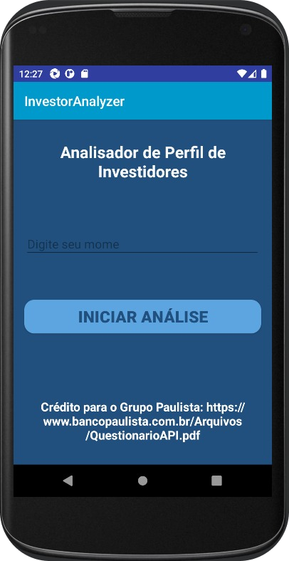

<h1 align="center">
     
    
🚀  Análise de Perfil de Investidor - APP

</h1>

 

 <strong>  Aplicativo para análise de perfil de investidor </strong> 
  Quando uma pessoa deseja realizar investimentos por intermédio de um banco ou uma corretora, é comum que 
  ela tenha que preencher um questionário para avaliar o seu perfil de investidor, de modo que ela possa ser 
  orientada para investimentos mais adequados ao seu momento de vida, patrimônio e propensão/tolerância ao risco.

 

<h1>
     
    
🎨 Layout

</h1>

     
     
     
     
     
     

<h1>
     
    
🛠️ Tecnologias Utilizadas

</h1>

 
 
 
  
  
  
 

 
    
⚙️ Requisitos

</h1>

O seu app deve ter no mínimo 3 Activities:
                                                 
-Activity que controla a tela inicial, onde há uma explicação da função do app, um campo de texto para o usuário inserir o seu nome e um botão para iniciar o teste.
-Activity que apresenta as perguntas do formulário de análise de perfil de investidor, seguindo a metodologia do Banco Paulista, conforme o arquivo presente no link acima.
-Activity de resultado, que exibe o nome do usuário e o seu perfil de investidor.

<h1>
     
    
👋 Saudações, Eli!

</h1>

_Caso queira contribuir com meu projeto, será totalmente bem-vindx!!!_
_Qualquer dúvida ou sugestão, chama no contatinho!_

 

### Vamos nos conectar!

- [LinkedIn](https://www.linkedin.com/in/elisabete-a-santos/)
- [GitHub](https://github.com/elisabetealves)

### Feito com 💕 e muita dedicação
